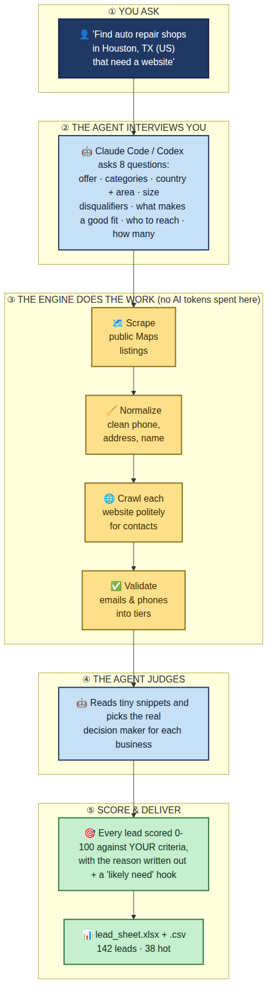
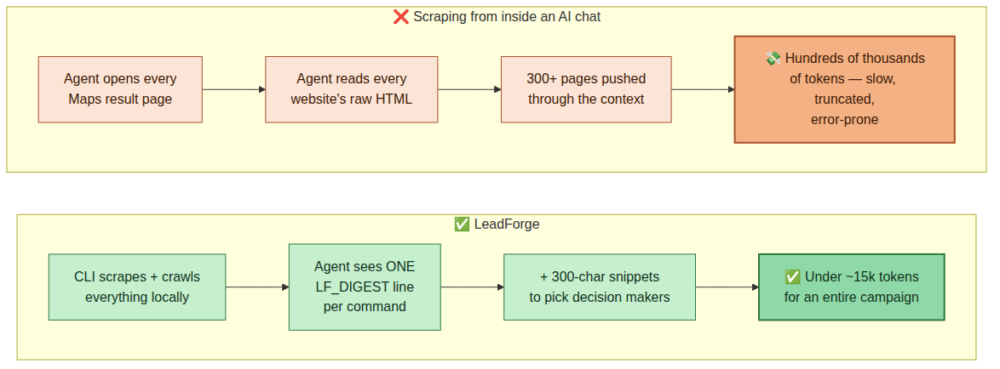
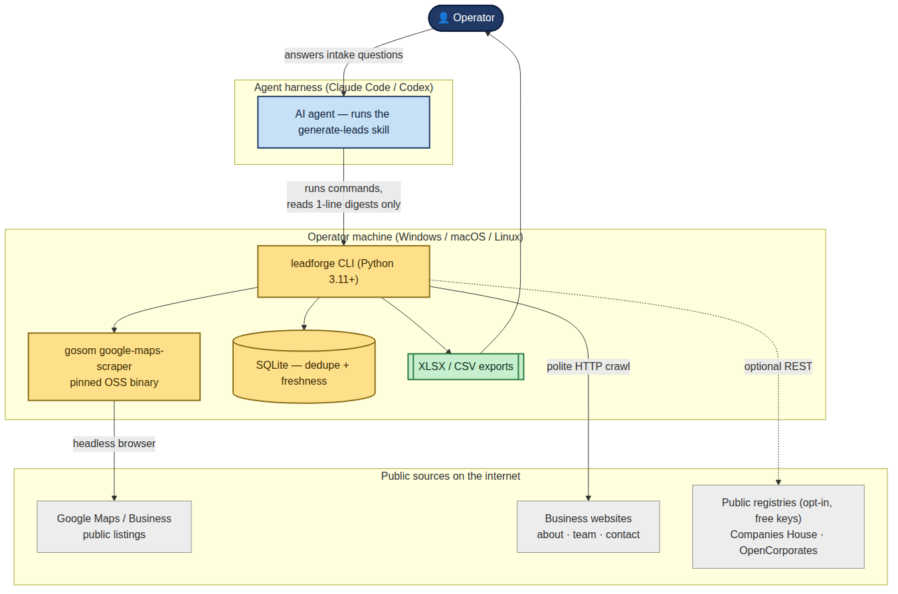

# LeadForge

**Internal B2B lead-generation engine.** Scrapes public business listings with open-source engines, deep-crawls
each business's website for contacts and the likely decision maker, scores every lead against your ICP, and
exports a clean, explained XLSX/CSV. Ships as one repo that installs into **Claude Code** and **OpenAI Codex**
as a plugin + Agent Skill.

> Internal tool, not a product. OSS-only: **no paid APIs, no API keys required** on the default path.

## How it works



## Why it exists

Doing this by hand is slow; doing it inside an AI chat burns enormous tokens on page dumps. LeadForge moves all
the heavy lifting into a Python CLI and leaves the agent three jobs: interview you about your ideal customer,
launch the pipeline, and judge who the decision maker is from tiny pre-extracted snippets. A full campaign costs
the agent **under ~15k tokens** — the pipeline itself processes hundreds of pages that never touch the model.



## Install


| Harness | Commands |
|---|---|
| **Claude Code** | `/plugin marketplace add AbdulrahmanAmer/leadforge` then `/plugin install leadforge@leadforge` |
| **Codex** | `codex plugin marketplace add AbdulrahmanAmer/leadforge` then install "LeadForge" from `/plugins` |
| **Any Agent-Skills harness** | `npx skills add AbdulrahmanAmer/leadforge` |
| **Plain CLI / bridge** | `git clone …` then `python install.py` |

Then, once, in the folder where you want your lead data to live:

```bash
leadforge doctor --fix     # installs missing Python deps + downloads the pinned scraper binary for your OS
```

Requires **Python 3.11+**. No compiler needed — every default dependency is a pure-python wheel.
Windows, macOS and Linux are equal citizens.

## Use it (the normal way)

Just ask your agent:

> "Find me B2B leads — auto repair shops in Houston that need a website."

The `generate-leads` skill triggers, interviews you (offer, categories, **country + specific area**, size band,
disqualifiers, what makes a good fit, decision-maker titles, volume), runs the pipeline, asks nothing else, and
hands back a sheet.

### Use it manually

```bash
leadforge intake --answers answers.yaml   # compile + validate your ICP -> icp.yaml
leadforge plan   --icp icp.yaml           # see the query plan before spending time
leadforge run    --icp icp.yaml           # discover -> enrich -> (pause for DM labeling) -> score -> export
leadforge dm export --max 60              # snippets for the agent to label
leadforge dm apply --in dm_labels.ndjson
leadforge run    --icp icp.yaml --resume  # score + export
leadforge status
leadforge suppress add someone@example.com   # opt-outs, honored everywhere
```

Everything lands under `./leadforge_data/` (gitignored): SQLite db, cache, logs, and `exports/<run>/` with the
XLSX, CSV and report.

## What a lead row contains

Score (0–100) and tier (A/B/C/DQ) · business name, category · **decision-maker name + title + confidence** ·
phone in E.164 · best email + validity tier · website · split address (street/city/region/postal/country) ·
rating and review count · **"Likely Need (Hook)"** — a ready outreach angle · **"Why This Score"** — the top
factors in plain words · Maps link · source and verified-on date.

The workbook also carries a **Summary** tab (counts, tier split, top hooks, compliance reminder for your region)
and an **About** tab that explains the columns — so your partner can read it without asking you.

## Under the hood

```
interview → ICP → geo-aware query plan → OSS Maps scraper → normalize (clean, sheet-ready fields)
   → polite website deep-crawl → emails/phones/socials/people candidates → validate (tiers, never booleans)
   → agent labels the decision maker from snippets → weighted ICP scoring with explanations → XLSX/CSV/SQLite
```



All diagrams as images: [`docs/diagrams/`](docs/diagrams/).
Architecture, data model, pipeline behavior and every decision are documented in [`docs/`](docs/):
[vision](docs/00-vision.md) · [research](docs/01-research.md) · [architecture](docs/02-architecture.md) ·
[data model](docs/03-data-model.md) · [pipeline](docs/04-pipeline-behavior.md) ·
[build plan](docs/05-icm-build-plan.md) · [token contract](docs/06-token-contract.md) ·
[compliance](docs/07-compliance.md) · [decisions](docs/08-decisions.md).

## Ground rules baked into the code

- **robots.txt respected** on business sites; one request in flight per host with a delay; identifying user-agent.
- **Caps** from your ICP are hard stops; a **suppression list** is honored at crawl, score and export time.
- **No SMTP probing** (email validity is reported as tiers, never a false binary), **no LinkedIn**, **no
  login-gated scraping**, **no anti-bot evasion**, **no outreach sending**. Public business data only.
- **Country is required** on every campaign and areas must be specific — vague locations are how lead lists fill
  with garbage, so the tool refuses them and asks instead of guessing.

See [`docs/07-compliance.md`](docs/07-compliance.md) for the practical GDPR/PECR/CAN-SPAM posture. Not legal advice.

## Status & finishing the build

The core pipeline works end to end (see `tests/test_pipeline_e2e.py`). A few optional units remain — a fallback
discovery provider, browser escalation for JS-heavy sites, registry cross-checks, and live validation against the
real scraper.

**To finish it with an AI coding session:** open the repo in Claude Code or Codex and say **`BUILD LEADFORGE`**
(or run `/finalize`, or paste [`icm/PROMPT.txt`](icm/PROMPT.txt)). The session self-orients from
[`icm/HANDOFF.md`](icm/HANDOFF.md) and works the checklist in [`icm/STATE.md`](icm/STATE.md).

```bash
pip install -e .[dev] && pytest -q && ruff check src tests   # baseline: 64 passed, 2 xfailed, clean
```

Optional extras: `.[browser]` (JS-rendered sites), `.[ner]` (local zero-shot name/title extraction),
`.[addressing]` (better US address splitting).

## License

MIT — see [LICENSE](LICENSE). Bundled/pinned third-party engines keep their own licenses; the Google Maps
scraper engine ([gosom/google-maps-scraper](https://github.com/gosom/google-maps-scraper), MIT) is downloaded at
setup time, not vendored.
