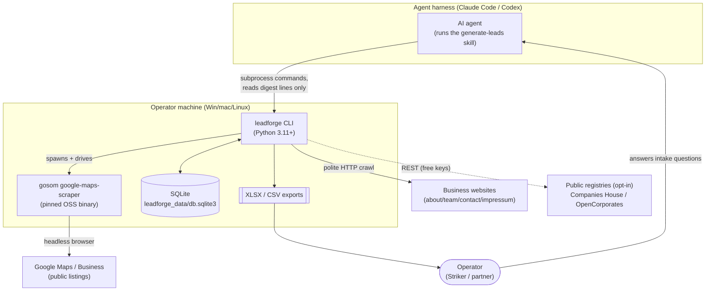
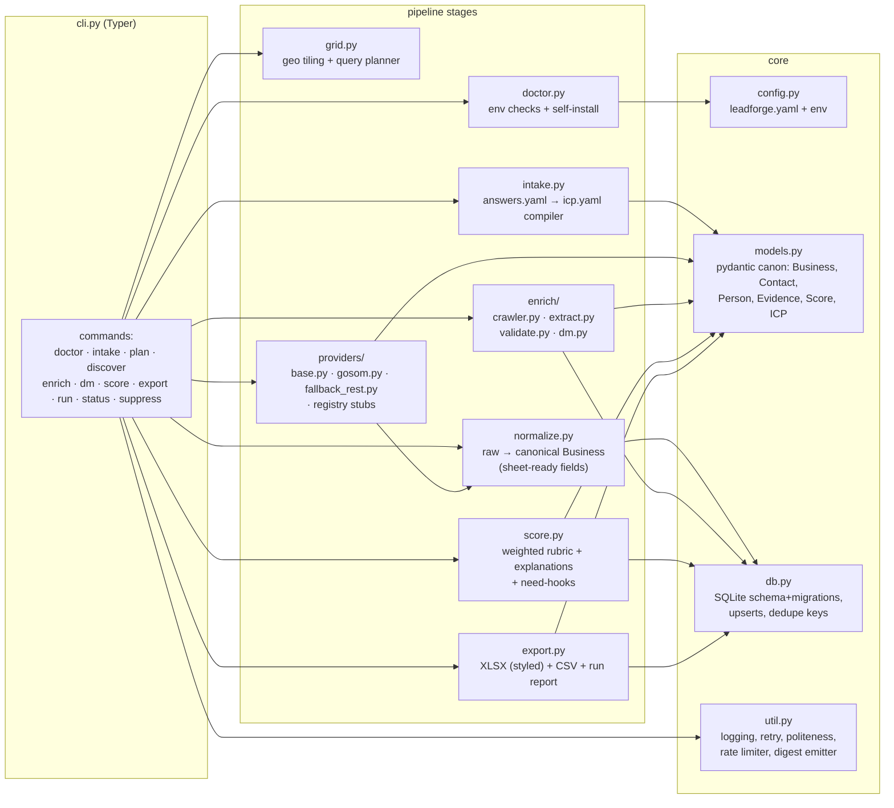
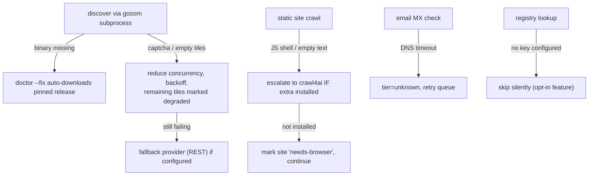

# Architecture

> 🖼️ **Rendered image:** [`diagrams/02-architecture.png`](diagrams/02-architecture.png) — read that first if you
> just want to see the shape of the system. All images: [`diagrams/`](diagrams/).

## 1. System context (C4-L1)

**The defining boundary:** the agent never touches raw web content. Everything noisy (HTML, scrape output, crawl text) stays on the CLI
side of the line; the agent sees only **digest lines** and **DM snippets** (`docs/06-token-contract.md`).

## 2. Component view (C4-L3, package `leadforge`)

### Responsibilities

| Module | Responsibility | Key rule |
|---|---|---|
| `cli.py` | Command surface; **every command ends with one `LF_DIGEST {json}` line** | No command may print unbounded output |
| `config.py` | Layered config: defaults → `config/leadforge.example.yaml` copy → workspace `leadforge.yaml` → env `LEADFORGE_*` | All paths under `leadforge_data/` |
| `models.py` | Canonical pydantic v2 models; the **only** schema in the system | Providers/enrichers must emit these — nothing else crosses module lines |
| `db.py` | Schema DDL + versioned migrations; idempotent upserts | Dedupe key = `place_id`, else `sha1(name_norm+addr_norm)` |
| `doctor.py` | Detect/install: pip deps, gosom binary (pinned, per-OS asset), optional Playwright, network reachability, disk | **Runs before every pipeline command** (cheap cached check) |
| `intake.py` | Validate agent-collected `answers.yaml` → compile `icp.yaml` (queries, qualifications, weights, caps) | Schema-validated; rejects vague ICPs with actionable errors |
| `grid.py` | Geocode area (Nominatim, cached) → bbox → grid tiles sized to density → query plan | Respects Google ~120-results/query cap by design |
| `providers/` | `DiscoveryProvider` ABC: `plan(icp) -> [Query]`, `fetch(query) -> [RawListing]`; gosom via subprocess `-json`; fallback via REST | Provider failures degrade, never abort the run |
| `normalize.py` | Raw listing → canonical `Business`: E.164 phone, split address (usaddress/pyap), category mapping, name cleanup, url canonicalization | **This is the "clean sheet formatting" guarantee** |
| `enrich/crawler.py` | Static-first polite crawl (httpx+selectolax+trafilatura): home, about, team, contact, impressum, sitemap probe; ≤ N pages/site; robots + per-host delay; escalation hooks to crawl4ai/Scrapling extras | Never crawls suppressed/out-of-scope domains |
| `enrich/extract.py` | Emails (mailto/regex/cfemail/at-dot), phones, socials, copyright-year staleness, person+title candidate snippets | Every fact → `Evidence(url, ts, snippet)` |
| `enrich/validate.py` | Email tiers (syntax→MX→disposable→role), phone validity, site liveness | Tiers, never booleans |
| `enrich/dm.py` | DM candidate store; `dm export` NDJSON snippets for the agent; `dm apply` labels back | Snippets ≤ 300 chars; batch caps |
| `score.py` | Rubric from `config/scoring.default.yaml` ⊕ ICP overrides; per-factor explanations; "likely need" hook synthesis | Deterministic, unit-tested |
| `export.py` | Styled XLSX (Leads + Summary + About sheets), CSV mirror, JSON run report | Column dictionary in `docs/03-data-model.md` §5 |

## 3. Tech stack & rationale

| Concern | Choice | Rationale (see `docs/08-decisions.md`) |
|---|---|---|
| Orchestrator | Python 3.11+, `src/` layout, pyproject | User requirement; ubiquitous on target machines |
| CLI | Typer + Rich(minimal) | Typed commands, `--json` everywhere, low dep weight |
| Models | pydantic v2 | Validation at every boundary; JSON-schema export for the skill docs |
| Discovery engine | gosom binary (pinned v1.17.4) via subprocess | ADR-001: MIT, maintained, native Windows exe, gridding + consent handling built in |
| Fallback discovery | conor-is-my-name REST (Docker) / noworneverev lib | ADR-001: independent selector implementations |
| Static crawl | httpx + selectolax + trafilatura | ADR-002: pure-python, Windows-clean, fastest |
| Browser escalation | crawl4ai / Scrapling as **optional extras** `[browser]` | Heavy Playwright dep off the default path |
| Contact validation | phonenumbers, email-validator, dnspython, disposable-email-domains | All permissive licenses, no native builds |
| DM identification | snippet export → **agent labels** (default); GLiNER extra `[ner]` | ADR-003: token-optimal + best quality |
| Storage | SQLite (stdlib) | ADR-004: zero-install, single-file, transactional |
| Export | openpyxl (xlsx) + csv (utf-8-sig) | Styled, filterable, Excel-safe |
| Resilience | tenacity retries, per-host token-bucket, stage checkpoints | Politeness + resumability |

## 4. Degradation ladder

Every degradation is **recorded on the run** and surfaces in the digest (`warnings`) and the Summary sheet — the run never silently lies
about coverage.

## 5. Cross-platform notes

- No native compiles anywhere on the default path (libpostal explicitly excluded; usaddress/pyap instead).
- gosom binary selected per `platform.system()/machine()`; stored in `leadforge_data/bin/`; never requires PATH edits.
- All subprocess calls: `shell=False`, explicit `encoding="utf-8"`, timeouts.
- Paths via `pathlib` only; LF endings enforced by `.gitattributes`; CSV written `utf-8-sig` so Excel on Windows opens clean.
- Long-run mode (`leadforge discover --serve`) drives gosom's `-web` REST API instead of one-shot subprocess — same provider interface.

## 6. Security & privacy

- No credentials required or stored by default; optional registry keys live in workspace `leadforge.yaml` (gitignored) or env vars.
- `leadforge_data/` is gitignored — scraped personal data never lands in the shared repo.
- Suppression table filters opted-out domains/emails at crawl, score, and export time.
