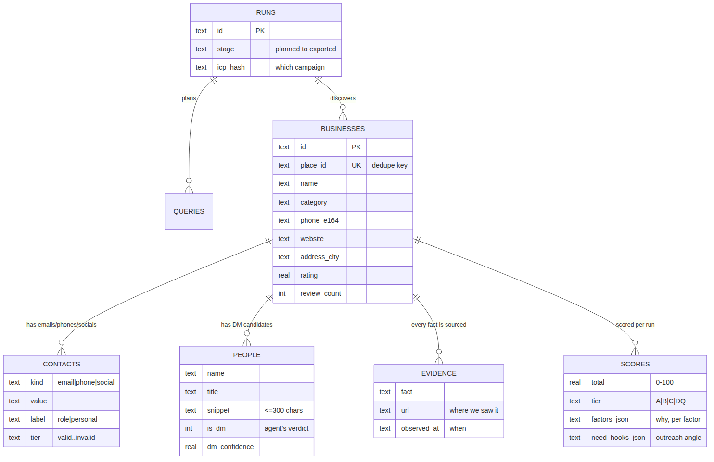
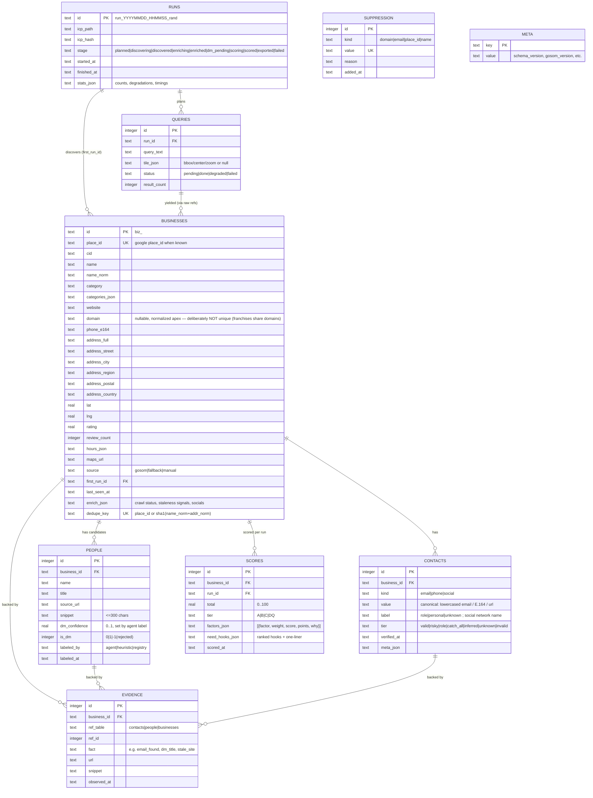

# Data Model

Single canonical schema. Providers, enrichers, scorers and exporters all speak these shapes (`src/leadforge/models.py` = source of truth;
this doc mirrors it).

> 🖼️ **Rendered image:** [`diagrams/06-data-model.png`](diagrams/06-data-model.png)



## 1. ERD (SQLite)



## 2. Canonical pydantic models (mirror)

- `ICP` — campaign, offer{what,value_prop,sender}, target{categories[], geography{areas[]|bbox, grid}, size{...}},
  qualify{hard[], soft[]}, decision_maker{titles_priority[]}, scoring{weights_override{}}, caps{max_leads, max_sites, max_tiles},
  compliance{region_profile}.
- `RawListing` — provider-agnostic dict + `provider`, `fetched_at`, `query_id`. Never persisted raw beyond `leadforge_data/cache/`.
- `Business`, `Contact`, `Person`, `Evidence`, `Score` — as ERD above.
- `Digest` — {ok, cmd, run, counts{}, warnings[], artifacts[], next} → the **only** thing the agent must parse.

## 3. Normalization rules (the "clean sheet" layer)

| Field | Rule |
|---|---|
| `name` | strip whitespace/emoji, collapse spaces; `name_norm` = casefold, strip legal suffixes (llc, inc, ltd, gmbh) + punctuation |
| `phone_e164` | `phonenumbers.parse(raw, region_from_country)` → E.164 only if `is_valid_number`; else keep raw in `meta_json.raw_phone`, tier `unknown` |
| `website`/`domain` | lowercase host, strip tracking params + fragments, follow `www.`→apex for `domain`; social-platform URLs are **not** websites (moved to socials) |
| address | prefer provider `complete_address` struct; else usaddress (US) / pyap (US/UK/CA) parse of `address_full`; unparsed → `address_full` only, warning counted |
| `category` | map provider category → ICP taxonomy (exact → adjacent via alias table in `config/leadforge.example.yaml`); keep original list in `categories_json` |
| email | lowercase, strip `mailto:`, deobfuscate (cfemail XOR, `[at]/[dot]`, entities); label `role` if local-part ∈ {info, sales, office, contact, hello, admin, support, …} |
| dedupe | `place_id` wins; else `sha1(name_norm + "|" + casefold(address_street+city))[:12]`; merges keep richest field per column + union evidence |
| freshness | every contact/person/score carries a timestamp; export flags rows whose newest verification > `staleness_days` (default 90) |

## 4. ICP file (`icp.yaml`) — authoritative example

```yaml
version: 1
campaign: auto-repair-houston-webdesign
offer:
  what: "Website redesign + booking system for auto repair shops"
  value_prop: "More booked jobs, fewer missed calls"
  sender: "Striker's agency"
target:
  categories: ["auto repair shop", "car repair", "transmission shop"]
  geography: { areas: ["Houston, TX"], grid: auto }   # or bbox: [minLng,minLat,maxLng,maxLat]
  size: { min_reviews: 10, max_reviews: null }
qualify:
  hard:                       # any true → disqualified (DQ)
    - franchise_or_chain
    - no_phone
  soft:                       # scored, not fatal
    - website_missing         # for a web-design offer this is a POSITIVE need signal → weight in scoring.needs
    - low_rating_high_volume
decision_maker:
  titles_priority: ["Owner", "General Manager", "Service Manager"]
scoring:
  weights_override: {}        # see src/leadforge/data/scoring.default.yaml (packaged rubric)
caps: { max_leads: 200, max_sites: 300, max_tiles: 60 }
compliance: { region_profile: us }   # us|uk|eu → outreach reminder text in export
```

## 5. Export column dictionary (Leads sheet, in order)

| Col | Source | Notes |
|---|---|---|
| Score | scores.total | number, 0 dp |
| Tier | scores.tier | A/B/C/D/DQ, conditional fill |
| Business | businesses.name | |
| Category | businesses.category | ICP-mapped |
| DM Name / DM Title / DM Conf | people where is_dm=1 | natural "First Last" order; Conf 0–1. Never blank: unlabeled → "not identified - ask for owner/manager" |
| Phone | phone_e164 | spaced international format ("+44 1483 456363" — survives Excel as text); raw Maps string as fallback |
| Email / Email Tier | best PUBLISHED contact (tier order: valid>role>risky>catch_all>unknown) | never export `invalid`; `inferred` is excluded here by design (own column); absent → "none published" / "site not crawled" / "no website to crawl", tier `-` |
| Email (Inferred) | v0.2.0, opt-in `validation.infer_emails`: the address this domain's own naming convention implies for the named DM, derived from a real email already found on that domain + MX. Never SMTP-probed | rendered as `addr (likely, N% — pattern X from <anchor>)`; excluded from `with_email` coverage (counted as `with_inferred_email`); absent → "not inferred" |
| Website | businesses.website | hyperlink; absent → "NONE - no web presence (pitch opportunity)" |
| Address / City / Region / Postal / Country | split fields | sheet-ready |
| Rating / Reviews | rating, review_count | |
| Likely Need (Hook) | scores.need_hooks_json[0] | one line, human-ready |
| Why This Score | top 3 factors_json "why" joined | audit trail |
| Maps | maps_url | hyperlink |
| Source | businesses.source | which engine discovered it (gosom = Google Maps) |
| Verified On | evidence roll-up | timestamp of the newest evidence for the row |
| Stale? | Verified On vs `validation.staleness_days` | `-` fresh; `yes` stale; `never verified`; `unknown (bad timestamp)` |
| Opening Hours | businesses.hours_json | "Mon 9AM-6PM \| … \| Sun closed" from the listing; `-` when unknown |
| Company No | enrich_json.registry_profile | official registry number; else "not matched in registry" / "not looked up" |
| Incorporated | enrich_json.registry_profile | incorporation year; `-` unknown |
| Company Status | enrich_json.registry_profile | e.g. active / dissolved; `-` unknown |
| SIC Codes | enrich_json.registry_profile | comma-separated; `-` unknown |
| Call Readiness | derived at export | `READY - named contact` (validated phone + DM) / `READY - ask switchboard` (validated phone, no DM) / `UNVERIFIED PHONE - confirm number` (only a raw unparsed number) / `NO PHONE - research first` |

**Zero blank cells:** a cell is never empty — placeholder text says why it would have been; anything still empty is
written as `-`. Summary/report coverage stats count only real data, never placeholders. With
`scoring: {profile: account_fit}` the sheet appends 14 account-intel columns: Employees, Employee Range, Revenue,
Departments, Microsoft 365, CRM, ERP, Other Systems, Trigger, Trigger Strength, LinkedIn, Contactability,
Data Confidence, Status.

**Summary sheet:** run config, counts per stage, tier histogram, degradations/warnings, top hooks ranked, compliance reminder for the
chosen region profile. **About sheet:** column dictionary + tier semantics (so the sheet explains itself to the partner).
