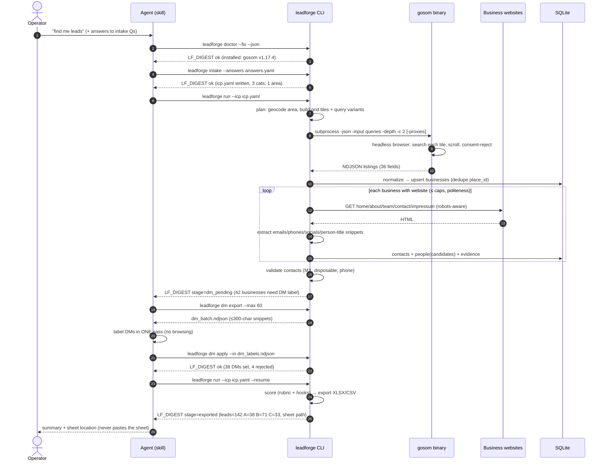
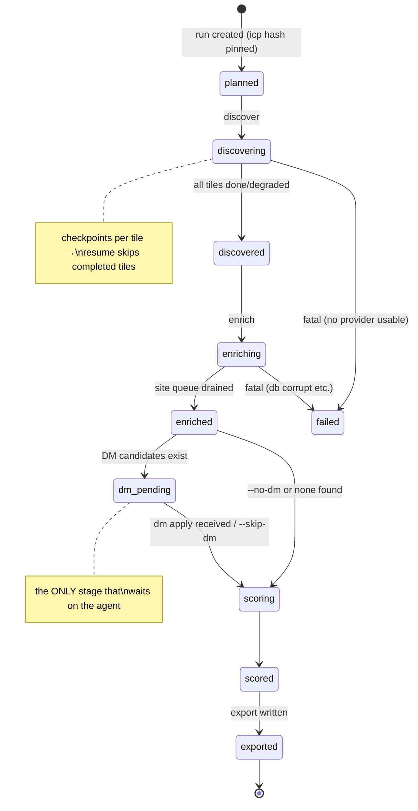

# Pipeline Behavior — end to end

> 🖼️ **Rendered images:** [`diagrams/03-pipeline-sequence.png`](diagrams/03-pipeline-sequence.png) (the timeline)
> and [`diagrams/04-run-states.png`](diagrams/04-run-states.png) (the state machine).

## 1. Full-run sequence

## 2. Run state machine

`leadforge run` is a **resumable orchestrator**: it reads the run's stage from SQLite and continues from there. `--resume` picks the
latest run for the same ICP hash; every stage is idempotent (upserts, per-tile / per-site checkpoints).

## 3. Stage specs

### 3.1 plan (inside `run`, or `leadforge plan`)
- Geocode each `geography.areas[]` via Nominatim (`https://nominatim.openstreetmap.org/search`, 1 req/s, cached forever in
  `leadforge_data/cache/geocode.json`, UA identifies the tool).
- Build grid: bbox split into tiles of `grid_cell_km` (default 3 km, auto-shrink for dense urban categories) — capped by `caps.max_tiles`.
- Query plan = tiles × category variants. Estimate shown in digest (`tiles`, `queries`, `est_max_results` = queries × 120).

### 3.2 discover
- Provider order from config (`providers.discovery: [gosom, fallback_rest]`). Per query: provider `fetch()` with retry/backoff
  (tenacity: 3 tries, expo 2–30 s).
- gosom invocation (subprocess mode): input file of queries (one per line, gosom `-input`), flags:
  `-json -results <out.ndjson> -depth <cfg> -c <cfg,default 2> -lang <cfg> [-proxies <cfg>] -exit-on-inactivity 3m`; grid runs use
  `-grid-bbox`/`-grid-cell`/`-zoom` per tile instead of plain text queries. Timeout per batch: `discovery.timeout_min` (default 30).
- Output NDJSON parsed → `RawListing` → `normalize.to_business()` → upsert (dedupe). Tile marked done + result_count.
- Degradations: empty tile after retries → `degraded`; captcha signature in stderr → global cooldown (default 10 min) then halve
  concurrency; binary crash → try fallback provider for remaining tiles.

### 3.3 enrich
- Site queue = businesses with `domain`, not suppressed, ordered by ICP fit potential (category match first), capped by `caps.max_sites`.
  With the `[browser]` extra installed, sites a previous pass flagged `needs_browser` re-enter the queue for their rendered retry.
- Per site (politeness): robots.txt fetch/parse (cached); skip disallowed paths; per-host delay `politeness.delay_s` (default 2.0, jitter
  ±30%); global concurrency `politeness.workers` (default 4 hosts in parallel, 1 request in flight per host); UA
  `LeadForgeBot/<ver> (internal lead research; +contact-in-repo)`; hard per-page timeout 15 s; max `crawl.pages_per_site` (default 6).
- Page selection: `/` always; then discovered nav links matching (about|team|staff|people|leadership|contact|impress|imprint|legal
  |meet) up to cap; sitemap.xml probe if nav yields < 2 targets.
- Extraction per page (`extract.py`): mailto + email regex + cfemail decode + at/dot normalization; tel: links + phone regex →
  phonenumbers; social links (allowlist hosts); copyright-year → `stale_site` signal if < current_year − 2; person+title candidates:
  lines/headings where a Title keyword (Owner, CEO, Founder, GM, Manager, Director, Principal, Broker, …) sits within 60 chars of a
  Capitalized-Name pattern → snippet (≤300 chars) + source URL stored on `people`.
- JS-shell detection: extracted text < 400 chars AND `<script src=` count high → if extra `[browser]` installed, re-fetch via crawl4ai;
  else mark `needs_browser` (surfaces in digest warnings + Summary).
- Bot-wall fallback (v0.1.4): a site that refuses the plain HTTP client with a block-shaped status (401/403/405/406/429/503) is retried
  once with a real rendered browser — other failures (plain 5xx, timeouts) are not. **Robots-disallowed sites never escalate**: the site
  said no, so the browser must not go either. An unreachable/5xx robots.txt counts as complete disallow per RFC 9309 §2.3.1.4; a 4xx
  robots.txt means none published → allow.
- validate (`validate.py`): emails — syntax (email-validator) → MX (dnspython, 5 s timeout, per-domain cache) → disposable list → role
  classification → tier; phones — `phonenumbers.is_valid_number`; site liveness recorded (status, elapsed).

### 3.4 dm loop (agent-in-the-loop)
- `dm export`: businesses with ≥1 person candidate and no accepted DM → NDJSON, one line per business:
  `{"biz":"biz_ab12","name":"…","category":"…","icp_titles":["Owner",…],"candidates":[{"i":0,"name":"…","title":"…","snippet":"…"}]}` —
  capped `--max` (default 60 businesses/batch).
- Agent labels **from snippets only** (no browsing) → `dm_labels.ndjson`:
  `{"biz":"biz_ab12","pick":0,"confidence":0.9,"title_override":null}` or `{"biz":"…","pick":-1}` (none credible).
- `dm apply`: sets `people.is_dm`, confidence, labeled_by=agent; unlabeled businesses simply export without DM (never blocks the run).
- Registry cross-check: see §3.4b — adds `people` rows labeled_by=registry with evidence; boosts `data_confidence` factor.

### 3.4b registry stage (v0.1.2)
- Runs for **every** business in a covered jurisdiction — including site-less ones, which never enter the crawl stage (where lookups
  used to happen). Silent no-op without a configured key. Run alone via `leadforge enrich --stage registry`
  (`--stage` accepts all|site|registry|validate).
- Companies House (GB/UK; key via `leadforge config set registry.companies_house_key …`): company search by name, candidates filtered
  by locality match against the business address; stores the matched **company profile** (number, incorporation date, status, SIC
  codes) in `enrich_json.registry_profile` → the sheet's Company No / Incorporated / Company Status / SIC Codes columns; then
  `/company/{n}/officers` → active (non-resigned) officers as `people` rows labeled_by=registry, each with evidence.
- Auto-DM (ADR-010): exactly ONE active individual director (corporate officers filtered out) and no DM already chosen → auto-marked DM
  at confidence 0.9 — official-registry evidence beats agent inference, so big runs don't queue the obvious cases. 0 or 2+ individuals
  stay with the agent.
- OpenCorporates (token required) is the fallback for its jurisdictions (GB/US). On a 429 a registry backs off 60 s once, then disables
  itself and the stage stops rather than hammering the rate limit. Every looked-up business is stamped `registry_checked` so re-runs
  never repeat lookups.
- Heartbeat: the `LF_PROGRESS` stream carries `registry` and `validate` stages alongside `discover`/`enrich` (docs/06).

### 3.5 score
- Load `src/leadforge/data/scoring.default.yaml` (packaged, via importlib.resources) ⊕ `icp.scoring.weights_override`. For each business: evaluate factor functions (pure, unit-tested)
  → points + one-line `why`; sum, clamp 0–100; apply negative rules (cap −40); tier A ≥ 75 / B ≥ 55 / C else / DQ if any hard qualifier
  hit. Need-hooks: rule table (e.g. `website_missing` → "No website — pitch full build + booking"), ranked, top hook exported.

### 3.6 export
- XLSX via openpyxl (Leads / Summary / About sheets per `docs/03` §5): frozen header, autofilter, tier conditional fill, hyperlinks,
  column widths, zebra rows. CSV mirror `utf-8-sig`. JSON run report → `leadforge_data/exports/<run>/report.json`.
- **Zero blank cells** (v0.1.2): a cell is never empty — placeholder text says why it would have been ("none published",
  "not matched in registry", …); anything still empty is written as `-`. Summary/report coverage counts only real data, never
  placeholders.
- **Call Readiness** (derived per row): `READY - named contact` (validated phone + DM) / `READY - ask switchboard` (validated phone,
  no DM) / `UNVERIFIED PHONE - confirm number` (only a raw unparsed number) / `NO PHONE - research first`.
- Digest artifacts list absolute paths. Nothing is printed from the sheet itself.

## 4. Error taxonomy

| Class | Examples | Behavior | Exit code |
|---|---|---|---|
| `EnvError` | missing dep, no binary, no network | doctor message + fix hint in digest | 3 |
| `InputError` | invalid answers.yaml/icp.yaml | field-level errors in digest | 4 |
| `ProviderDegraded` | captcha, empty tiles, timeouts | recorded, run continues | 0 (warnings) |
| `ProviderFailed` | all providers dead | run → failed, partial data kept | 5 |
| `PipelineBug` | unexpected exception | traceback → `leadforge_data/logs/`, digest ok=false | 1 |

## 5. Politeness & safety invariants (enforced in code)

1. Business-site crawl **always** checks robots.txt and per-host delay; no more than 1 in-flight request per host.
2. Global caps from ICP (`max_leads`, `max_sites`, `max_tiles`) are hard stops.
3. Suppression list consulted at discover-upsert, enrich-queue, and export.
4. Maps scraping runs at conservative defaults (`-c 2`, depth 10) unless the operator raises them in `leadforge.yaml`.
5. Raw scrape/crawl artifacts live only in `leadforge_data/cache/` (gitignored) with a size-capped LRU (default 500 MB).
