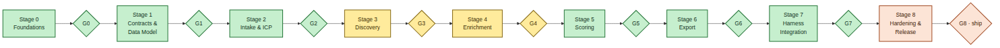
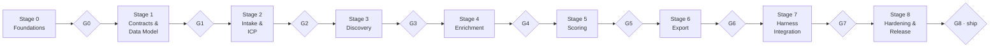

# ICM Build Plan — stages, units, gates

This plan follows an **Incremental Commitment Model (ICM)** shape: the build advances through staged commitments; each stage bundles
**units** (atomic work packages with their own spec, files, and acceptance criteria) and ends at a **gate** — objective exit criteria that
must pass before committing to the next stage. The repo you are reading was produced by executing Stages 0–7 at scaffold level; the
remaining work is precisely enumerated so a coding agent (Claude Code / Codex) can **one-shot finalize** it.

**Status legend:** ✅ `IMPLEMENTED` (working code in this repo) · 🧩 `STUB` (interface + spec present, body raises `NotImplementedError`)
· 🔨 `TO-BUILD` (no code yet; spec below) · 📄 `DOC` (documentation deliverable, done).

## 0. Stage map

> 🖼️ **Rendered image:** [`diagrams/05-icm-stages.png`](diagrams/05-icm-stages.png) — green = done, yellow =
> partially done, orange = remaining.

Dependency rule: a unit may only depend on units in its own or earlier stages. Optional units (⭐) never block a gate.

---

## Stage 0 — Foundations & Environment

| Unit | Deliverable | Files | Status |
|---|---|---|---|
| **U0.1** Repo skeleton | src layout, gitattributes/ignore, LICENSE, CHANGELOG | repo root | ✅ |
| **U0.2** Packaging | `pyproject.toml`: core deps lean, extras `[browser] [ner] [registry] [dev]`, console script `leadforge` | `pyproject.toml` | ✅ |
| **U0.3** Config system | layered load: built-in defaults → `leadforge.yaml` (workspace) → `LEADFORGE_*` env; all state under `leadforge_data/` | `src/leadforge/config.py` | ✅ |
| **U0.4** Logging & digest | rotating file log; stdout discipline; `emit_digest()`; token-bucket `HostThrottle`; `retry()` helper | `src/leadforge/util.py` | ✅ |
| **U0.5** Doctor / bootstrap | checks: python≥3.11, core imports, gosom binary (auto-download pinned release per-OS to `leadforge_data/bin/`), optional extras, DNS+HTTPS reachability, disk, writability; `--fix` installs; cached ok-stamp (24 h) | `src/leadforge/doctor.py` | ✅ |

**Gate G0:** `pip install -e .[dev]` clean · `leadforge doctor --json` exits 0 on a networked machine, and `--fix` downloads the gosom
binary on Win+mac+Linux (binary run `-h` returns 0) · `pytest tests/test_smoke.py` green.

## Stage 1 — Contracts & Data Model

| Unit | Deliverable | Files | Status |
|---|---|---|---|
| **U1.1** Canonical models | pydantic v2: ICP, RawListing, Business, Contact, Person, Evidence, Score, Digest (see docs/03) | `src/leadforge/models.py` | ✅ |
| **U1.2** SQLite layer | DDL for all tables (docs/03 ERD), `schema_version` migration runner, idempotent upserts w/ richest-field merge, dedupe keys, suppression checks | `src/leadforge/db.py` | ✅ |
| **U1.3** Model↔DB tests | round-trip, merge behavior, dedupe collisions | `tests/test_db.py`, `tests/test_models.py` | ✅ |

**Gate G1:** ERD in docs/03 matches DDL 1:1 (column audit) · upsert of the same business from two providers yields one merged row with
union of evidence · tests green.

## Stage 2 — Intake & ICP Compiler

| Unit | Deliverable | Files | Status |
|---|---|---|---|
| **U2.1** Answers schema | `answers.yaml` the agent writes from the interview (question bank in `skills/generate-leads/references/icp-guide.md`) | models + reference doc | ✅ |
| **U2.2** ICP compiler | `leadforge intake`: validate answers → derive category variants, geography plan hints, qualification lists, scoring overrides, caps → write `icp.yaml`; actionable field errors | `src/leadforge/intake.py` | ✅ |
| **U2.3** ICP examples | auto-repair/web-agency + generic tech-B2B examples | `config/icp.example.yaml`, reference doc | ✅ |

**Gate G2:** malformed answers produce ≤ 15 lines of precise errors (no traceback) · compiled `icp.yaml` re-validates → identical hash
(deterministic) · example ICPs compile.

## Stage 3 — Discovery

| Unit | Deliverable | Files | Status |
|---|---|---|---|
| **U3.1** Provider ABC + registry | `DiscoveryProvider.plan/fetch`, config-ordered chain, degradation semantics | `providers/base.py` | ✅ |
| **U3.2** Grid & query planner | Nominatim geocode (cached, 1 rps), bbox→tiles (default 3 km, cap `max_tiles`), tile×category query plan | `src/leadforge/grid.py` | ✅ |
| **U3.3** gosom adapter | pinned v1.17.4; write query file; subprocess `-json -results … -depth -c -lang -exit-on-inactivity 3m` (+ `-grid-bbox/-grid-cell/-zoom` per tile; `-proxies` passthrough); NDJSON parse → RawListing; stderr captcha/crash classification → cooldown/degrade | `providers/gosom.py` | ✅ |
| **U3.4** Normalizer | raw→Business per docs/03 §3 (E.164, address split usaddress/pyap, category alias map, url canon, name_norm, dedupe_key) | `src/leadforge/normalize.py` | ✅ |
| **U3.5** `discover` command | orchestrate U3.1–U3.4 with per-tile checkpoints + digest | `cli.py` | ✅ |
| **U3.6** Fallback REST provider | conor-is-my-name docker REST (`GET /scrape-get?query=`) adapter; health-check; same RawListing out | `providers/fallback_rest.py` | 🧩 |
| **U3.7** ⭐ Long-run serve mode | drive gosom `-web` REST (`:8080/api`, OpenAPI) for multi-hour jobs; `discover --serve` | `providers/gosom.py` | 🔨 |

**Spec U3.6:** constructor takes `base_url` from config (`providers.fallback_rest.url`, default `http://localhost:8765`); `fetch()` GETs
`/scrape-get` with `query`, `max_results`; 30 s timeout; map fields {name→name, address, phone, website, rating, reviews, lat, lng,
place_id?}; missing place_id → dedupe by name+addr path; classify HTTP 5xx/timeouts as degraded. Acceptance: with the docker container
running locally, `leadforge discover --provider fallback_rest --limit 5` upserts ≥ 1 business; with it down, run degrades (ok digest,
warning) instead of failing.

**Gate G3:** live smoke on the dev machine: one small ICP (1 category × small town) → ≥ 20 businesses in SQLite with ≥ 90% having
phone-or-website, 0 duplicate `place_id` rows · captcha path manually simulated (kill binary mid-run) → resume completes remaining tiles.

## Stage 4 — Enrichment

| Unit | Deliverable | Files | Status |
|---|---|---|---|
| **U4.1** Polite crawler | httpx static-first per docs/04 §3.3 (robots, per-host delay+jitter, 1-in-flight/host, page selection, sitemap probe, JS-shell detect) | `enrich/crawler.py` | ✅ |
| **U4.2** Extractors | emails (mailto/regex/cfemail/at-dot), phones, socials allowlist, copyright-staleness, person+title candidate snippets (≤300 chars) + evidence | `enrich/extract.py` | ✅ |
| **U4.3** Validators | email tiers syntax→MX→disposable→role; phone validity; liveness | `enrich/validate.py` | ✅ |
| **U4.4** DM loop | `dm export` NDJSON batches (≤60, `--tsv` variant) · `dm apply` labels → people.is_dm | `enrich/dm.py`, `cli.py` | ✅ |
| **U4.5** ⭐ Browser escalation | crawl4ai adapter behind `[browser]` extra: re-fetch `needs_browser` sites → `fit_markdown` → same extractors | `enrich/browser.py` | 🧩 |
| **U4.6** ⭐ Registry cross-check | Companies House (free key) + OpenCorporates (free token) officer/PSC lookup → people rows `labeled_by=registry` + evidence; config-gated | `providers/registry.py` | 🧩 |
| **U4.7** ⭐ Local NER upgrade | GLiNER zero-shot person/title extraction behind `[ner]` extra, replacing heuristic candidates when installed | `enrich/dm.py` hook | 🔨 |
| **U4.8** ⭐ Social/video presence | Agent-Reach reads the public business profiles the site itself links (YouTube/FB/IG): exists? last post? → `stale_social` / `no_social_presence` / `no_video_presence` signals + hooks. Config-gated, LinkedIn excluded, logged-out only | `providers/social.py` | 🧩 |

**Spec U4.5:** `browser.py` exposes `fetch_rendered(url) -> str (markdown)`; import crawl4ai lazily; raise `EnvError` with install hint if
extra missing; respect same politeness (delay, robots); cap 3 pages/site rendered. Acceptance: a known JS-only site (e.g. a React SPA
brochure site) yields ≥ 1 email/person candidate that static crawl missed.

**Spec U4.6:** `RegistryProvider.lookup(business) -> list[Person]`; Companies House: search company by name+locality, then
`/company/{n}/officers` (600 req/5 min throttle); OpenCorporates: `GET /v0.4/companies/search?q=`+jurisdiction with token. Only run for
businesses in profiles uk/us-with-token; never block the run; add `registry_corroborated` evidence used by the confidence factor.
Acceptance: with a key configured, a known UK company yields ≥ 1 officer person row; without keys the unit is a silent no-op.

**Gate G4:** enrich 20 real small-business sites: ≥ 60% yield ≥ 1 contact; robots-disallowed path never fetched (assert in log);
per-host delay honored (timing test); `dm export` → hand-label → `dm apply` round-trip sets is_dm correctly · unit tests for extractors
(obfuscation cases) green.

## Stage 5 — Scoring & Qualification

| Unit | Deliverable | Files | Status |
|---|---|---|---|
| **U5.1** Rubric engine | factor functions (fit/reachability/need/confidence/negatives) per docs/01 §5, weights from `config/scoring.default.yaml` ⊕ ICP override; per-factor `why`; tiers; DQ on hard qualifiers | `src/leadforge/score.py` | ✅ |
| **U5.2** Need-hook synthesis | rule table signal→hook line (offer-aware templates from ICP.offer) | `score.py` | ✅ |
| **U5.3** Scoring tests | golden cases incl. weight overrides + negative caps | `tests/test_score.py` | ✅ |

**Gate G5:** scoring a fixture set is deterministic and total-order stable · flipping one ICP weight changes ranks predictably (test) ·
every exported score has ≥ 3 non-empty `why` strings.

## Stage 6 — Store & Export

| Unit | Deliverable | Files | Status |
|---|---|---|---|
| **U6.1** XLSX exporter | Leads/Summary/About sheets per docs/03 §5: frozen header, autofilter, tier fills, hyperlinks, widths, staleness flags | `src/leadforge/export.py` | ✅ |
| **U6.2** CSV + report | `utf-8-sig` CSV mirror; `report.json` run stats | `export.py` | ✅ |
| **U6.3** Cross-run freshness | re-verification of rows older than `staleness_days` on new runs touching same dedupe_key | `db.py` + `cli.py` | ✅ |

**Gate G6:** exported XLSX opens clean in Excel (Windows) and LibreOffice: filters work, links click, tiers colored, Summary counts equal
DB counts · CSV re-imports losslessly.

## Stage 7 — Harness Integration

| Unit | Deliverable | Files | Status |
|---|---|---|---|
| **U7.1** Claude plugin | `.claude-plugin/plugin.json` + self-marketplace `marketplace.json` (`source: "./"`) | `.claude-plugin/` | ✅ |
| **U7.2** Codex plugin | `.codex-plugin/plugin.json` + `.agents/plugins/marketplace.json` (local source `"./"`) | `.codex-plugin/`, `.agents/` | ✅ |
| **U7.3** Skill | `skills/generate-leads/SKILL.md` — 6 spec-only frontmatter fields; body = interview→run→dm→deliver protocol + token rules; `references/{cli,icp-guide,dm-labeling,troubleshooting}.md` | `skills/` | ✅ |
| **U7.4** AGENTS.md / CLAUDE.md | repo instructions for any agent (Codex reads AGENTS.md; CLAUDE.md points to it + Claude specifics) | root | ✅ |
| **U7.5** User-scope bridge | `install.py`: copy/link skill into `~/.claude/skills` + `~/.agents/skills` (junction/copy on Windows), print per-harness install matrix; `python install.py --check` | `install.py` | ✅ |

**Gate G7:** `claude plugin validate .` passes · fresh Claude Code: `/plugin marketplace add AbdulrahmanAmer/leadforge` → `/plugin install
leadforge@leadforge` → skill listed & triggers on "find b2b leads" · fresh Codex: `codex plugin marketplace add AbdulrahmanAmer/leadforge` →
install via `/plugins` → `$generate-leads` visible; `npx skills add AbdulrahmanAmer/leadforge` also lands the skill.

## Stage 8 — Hardening & Release

| Unit | Deliverable | Files | Status |
|---|---|---|---|
| **U8.1** Test suite completion | crawler politeness timing test, gosom adapter parse fixtures, cli digest contract test (every command emits valid LF_DIGEST) | `tests/` | 🔨 partially ✅ |
| **U8.2** Live E2E validation | full campaign on the real Windows machine: small ICP → sheet; fix selector/field drift found | — | 🔨 |
| **U8.3** CI | GitHub Actions: ruff + pytest on 3.11/3.12, Win+Ubuntu matrix; `claude plugin validate` step | `.github/workflows/ci.yml` | 🔨 |
| **U8.4** Compliance guardrails audit | verify invariants list docs/04 §5 against code; suppression E2E test | — | 🔨 |
| **U8.5** Versioning & share | tag v0.1.0, README install matrix verified with partner's harness, CHANGELOG | — | 🔨 |

**Gate G8 (ship):** partner installs from the GitHub link on his machine and completes a campaign without editing code · CI green ·
`docs/` matches behavior (audit) · v0.1.0 tagged.

---

## One-shot finalize protocol (for the coding agent)

Execute in this order — it respects every dependency:

1. `pip install -e .[dev]` → `pytest` → fix anything red **before** new work (the scaffold ships green; a red test means environment
   drift — start at `leadforge doctor --fix`).
2. **U3.6** fallback provider → **U3.7** serve mode (optional) → re-run `pytest tests/test_providers.py`.
3. **U4.5** browser escalation → **U4.6** registries → **U4.7** NER (all optional-gated; each has acceptance criteria above).
4. **U8.1** finish test suite (specs in each test file's TODO header) → **U8.3** CI.
5. **U8.2** live E2E on this machine: `leadforge doctor --fix` → `leadforge intake --answers config/icp.example.yaml --from-icp-example`
   → `leadforge run --icp icp.yaml --limit 25`. Expect field drift in gosom output vs `providers/gosom.py` FIELD_MAP — fix the map, add a
   fixture from the real NDJSON, keep the test.
6. **U8.4** guardrails audit → **U8.5** tag + push.

**Definition of done per unit:** acceptance criteria met · tests added/updated · digest contract respected · docs updated if behavior
moved · no new dependency outside pyproject extras.
